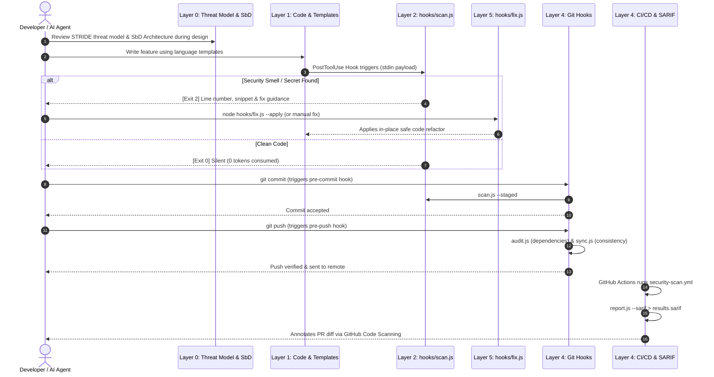

<div align="center">

# 🛡️ secure-coding

**Proactive OWASP Secure Coding, ACSC/CISA Secure-by-Design, Clean Code & AI Safety Engine**

[](checks/review.md)
[](checks/secure-by-design.md)
[](checks/sbom.md)
[](checks/iot-security.md)
[](checks/owasp-top10-2025.md)
[](checks/llm-top10.md)
[-brightgreen?style=for-the-badge&logo=checkmarx&logoColor=white)](hooks/test.js)
[](#-the-inverted-architecture)

<p align="center">
  <a href="#-quickstart--installation">⚡ Quickstart</a> •
  <a href="#-system-architecture">🏛️ Architecture</a> •
  <a href="#-how-each-layer-works">🔍 5-Layer Defense</a> •
  <a href="#-cli-reference-cookbook">🛠️ CLI Cookbook</a> •
  <a href="#-language-template-matrix">🌐 Templates</a> •
  <a href="#-ai-agent-integrations">🤖 AI Setup</a> •
  <a href="#-model-context-protocol-mcp-server">🔌 MCP Server</a>
</p>

---

</div>

## 💡 The Inverted Architecture

> [!IMPORTANT]
> **Traditional security checklists fail with AI agents.** Dumping 200+ rules into LLM context burns 30,000+ tokens, dilutes focus, and generates noisy post-write errors.

`secure-coding` inverts this paradigm into an **Inverted 5-Layer Defense-in-Depth Model**:

```text
┌─────────────────────────────────────────────────────────────────────────────┐
│  LAYER 0: PLANNING & SECURE-BY-DESIGN ARCHITECTURE (Progressive Disclosure) │
│  • STRIDE/DREAD  • ACSC Modern Defensible  • Zero Trust  • AI-SBOM (BSI)    │
├─────────────────────────────────────────────────────────────────────────────┤
│  LAYER 1: PROACTIVE DESIGN SHAPING (Pre-Write Rule Trigger Groups)          │
│  • 9 Focused Trigger Groups  • 13 Drop-In Templates (25 Standards Each)     │
├─────────────────────────────────────────────────────────────────────────────┤
│  LAYER 2: MECHANICAL SCANNER & SHANNON ENTROPY (0 Tokens Clean, <20ms)      │
│  • 32 Pattern Files (370 Regexes)  • Shannon Entropy H ≥ 3.5 Bits/Byte      │
├─────────────────────────────────────────────────────────────────────────────┤
│  LAYER 3: VERIFICATION & MULTI-ECOSYSTEM AUDITING                           │
│  • 213 Verifiable Controls  • 9 Package Managers  • 14 Clean Code Standards │
├─────────────────────────────────────────────────────────────────────────────┤
│  LAYER 4: POLICY GOVERNANCE, SBOM & SARIF CI/CD                             │
│  • Browser GUI Wizard  • CycloneDX v1.5 / SPDX v2.3  • OASIS SARIF v2.1.0   │
├─────────────────────────────────────────────────────────────────────────────┤
│  LAYER 5: AUTOMATED IN-PLACE REMEDIATION                                    │
│  • Deterministic In-Place Code Refactoring (hooks/fix.js --apply)           │
└─────────────────────────────────────────────────────────────────────────────┘
```

- ⚡ **Zero-Token Idle Cost**: Local hooks execute in ~1ms for a typical file (~20ms for 2,000 lines). If code is clean, it consumes **0 LLM tokens**.
- 🎯 **Progressive Disclosure**: Specialized architecture guides load on-demand **only** when touching relevant systems.
- 🛠️ **Deterministic Fixes**: Violations return exact line snippets with copy-pasteable `When / Wrong / Right / Watch` blocks.

---

## 🏛️ System Architecture

```mermaid
flowchart TD
    subgraph L0["Layer 0: Planning, Threat Modeling & Architecture"]
        TM["checks/threat-model.md<br/>• STRIDE Architecture &amp; DREAD Risk"]
        SBD["checks/secure-by-design.md<br/>• OWASP SbD 36-Control Checklist<br/>• ACSC Modern Defensible Architecture<br/>• Zero Trust &amp; CDS Ingress Normalization"]
        MEM["checks/memory-safety.md<br/>• Memory Safe Language (MSL) Selection<br/>• Safe C/C++ Intermediary Wrappers"]
        CRYPTO["checks/cryptography.md<br/>• FIPS 140-3 KMS Envelope Encryption<br/>• Post-Quantum Cryptography (ML-KEM, ML-DSA)"]
        IOT["checks/iot-security.md<br/>• AS ETSI EN 303 645 (13 IoT Principles)<br/>• Secure Boot, OTA Signing &amp; JTAG Lockout"]
        SBOM_GUIDE["checks/sbom.md<br/>• BSI 7 AI-SBOM Clusters<br/>• ACSC/CISA VEX Exploitability"]
        DEP["checks/deployment-safety.md<br/>• Pre-Mortem Failure Analysis<br/>• Canary Rollouts &amp; Automated Rollback"]
    end

    subgraph L1["Layer 1: Proactive Design (Progressive Disclosure)"]
        SKILL["SKILL.md (~3.6k tokens)<br/>• 9 Modular Trigger Groups"]
        TEMPLATES["templates/*.md (13 Languages)<br/>• 25 Secure Standards Each"]
        LLM["checks/llm-top10.md (~1.1k tokens)<br/>• OWASP Top 10 for LLMs (2025)"]
    end

    subgraph L2["Layer 2: Fast Mechanical Scanner (0 Tokens Clean)"]
        SCAN["hooks/scan.js (&lt;20ms)<br/>• Line Numbers &amp; Code Snippets"]
        ENTROPY["Shannon Entropy Engine<br/>• Un-prefixed Secret Detection ($H \\ge 3.5$)"]
        PATTERNS["patterns/*.txt (32 Files, 370 Regexes)<br/>• JWT, CORS, Deser, Cloud Keys, SbD, IoT"]
        SUPPRESS["Inline Comment Suppression<br/>• // secure-coding-ignore: id"]
    end

    subgraph L3["Layer 3: Verification & Auditing"]
        REVIEW["checks/review.md<br/>• 213 Verifiable Controls"]
        AUDIT["hooks/audit.js<br/>• 9 Ecosystems (npm, pnpm, yarn, pip, cargo, go...)"]
        CLEAN["hooks/clean.js<br/>• 14 Clean Code Quality Rules"]
    end

    subgraph L4["Layer 4: Policy, Governance & CI/CD"]
        WIZARD["reports/config-wizard.html<br/>• Interactive Browser UI Wizard"]
        CONFIG[".securecodingrc.json<br/>• Project Policy &amp; Severity Gates"]
        PR["hooks/report.js --markdown<br/>• GitHub/GitLab PR Comment Tables"]
        SARIF["hooks/report.js --sarif<br/>• OASIS SARIF v2.1.0 for Code Scanning"]
        SBOM["hooks/sbom.js<br/>• CycloneDX v1.5 &amp; SPDX v2.3 (AI &amp; VEX)"]
        GIT["install.sh / hooks/install.js<br/>• Git Pre-commit &amp; Pre-push Hooks"]
    end

    subgraph L5["Layer 5: Automated Remediation & MCP Server"]
        FIX["hooks/fix.js<br/>• --suggest &lt;id&gt; Guidance<br/>• --apply In-Place Refactoring<br/>• --dry-run Unified Diff Preview"]
        MCP["mcp/server.js<br/>• Native JSON-RPC 2.0 MCP Tools"]
    end

    L0 --> L1
    L1 --> L2
    L2 --> L3
    L3 --> L4
    L2 -. Violation Detected .-> L5
```



---

## 🔄 End-to-End Developer Lifecycle Flow



---

## 🔍 How Each Layer Works

### 🏛️ Layer 0: Planning, Architecture & Secure by Design
Applied during system design and boundary definition:
- **STRIDE & DREAD Threat Modeling** ([`checks/threat-model.md`](checks/threat-model.md)): Structured threat categorization and quantitative risk scoring.
- **OWASP SbD 36-Control Review & ACSC Defensible Architecture** ([`checks/secure-by-design.md`](checks/secure-by-design.md)): Edge Gateway, mTLS service meshes, Postgres Row-Level Security (RLS), Fail-Closed authorization, and Cross-Domain Solutions (CDS) ingress normalization.
- **Memory Safety Roadmaps & C/C++ Hardening** ([`checks/memory-safety.md`](checks/memory-safety.md)): Memory-Safe Language decision matrix, Safe Intermediary Wrappers, and compiler hardening (`-fstack-protector-strong`, ASan/UBSan, PIE, CFI).
- **FIPS 140-3 Cryptographic Key Management & PQC** ([`checks/cryptography.md`](checks/cryptography.md)): Hardware Root of Trust, Envelope Encryption (DEK/KEK), OIDC Workload Identity, and Post-Quantum transition (**ML-KEM / FIPS 203**, **ML-DSA / FIPS 204**).
- **AS ETSI EN 303 645 Consumer IoT Security** ([`checks/iot-security.md`](checks/iot-security.md)): 13 IoT principles, Multi-stage Secure Boot, cryptographically signed OTA updates, JTAG/UART lockout, and MQTTS/CoAPS.
- **Supply Chain, AI-SBOM & VEX** ([`checks/sbom.md`](checks/sbom.md)): BSI 7 AI Information Clusters, ACSC/CISA VEX exploitability states, and Sigstore/Cosign signing.
- **Safe Software Deployment** ([`checks/deployment-safety.md`](checks/deployment-safety.md)): Pre-mortem failure analysis, canary rollout pipeline (1–5%), and automated rollback circuit breakers.
- **Choosing Secure & Verifiable Technologies** ([`checks/technology-selection.md`](checks/technology-selection.md)): ACSC procurement questions for adopting a dependency, SaaS, or vendor — Secure by Default, supply chain due diligence, data jurisdiction, and the accept/transfer/avoid/mitigate decision.

### 📐 Layer 1: Proactive Design Rules & Language Templates
- **Trigger-Based Loading**: [`SKILL.md`](SKILL.md) categorizes security into 9 functional trigger groups. The agent reads only the group matching its immediate task. Full per-group requirements live in [`checks/code-groups.md`](checks/code-groups.md), keeping the always-loaded `SKILL.md` at ~3,650 tokens.
- **13 Drop-In Secure Templates** ([`templates/`](templates/)): Battle-tested implementations for all 25 OWASP standards across *TypeScript, JavaScript, Python, Go, Rust, Java, Kotlin, Swift, C#, C, PHP, Ruby, Shell*.
- **Progressive Disclosure for AI/LLMs** ([`checks/llm-top10.md`](checks/llm-top10.md)): High-density guidance (~1.1k tokens) covering all 10 OWASP LLM 2025 risks.

### ⚡ Layer 2: Reactive Mechanical Scanner (`hooks/scan.js`)
- **Fast Execution**: Pure Node.js standard library, zero dependencies. ~1ms for a typical file; ~20ms for a 2,000-line one, since multi-line taint tracking adds a per-line pass.
- **Precise Extraction**: Pinpoints exact line numbers and code snippets (`Line 42: const key = ...`).
- **Multi-Line Taint Tracking**: Regex alone only matches when untrusted input sits *inside* the sink call. The scanner also follows `var = req.query.x` into a later file, HTTP, process, or query call — reported as `taint-*` — within one function and one hop through interpolation. Sanitizers (`basename`, `validate`, `parseInt`, allowlist checks, parameterized queries) clear the taint. Disable with `"taintTracking": false`.
- **Per-Occurrence Findings**: Three SQL injections in one file are three findings, tracked by `(file, id, line)`. Fixing one closes only that one, so a partial fix can never silently clear a live vulnerability.
- **Shannon Entropy Secret Detection**:
  $$H(S) = -\sum_{i=1}^n p(x_i) \log_2 p(x_i)$$
  Calculates string randomness to distinguish true cryptographic keys ($H \ge 3.5\text{ bits/byte}$) from repetitive test strings (`"aaaaaaaaaaaaaaaa"`).
- **Inline Comment Suppression**: Allows fine-grained exclusions:
  ```typescript
  // secure-coding-ignore: eval
  const result = eval(sanitizedMathExpression);
  ```

### 🔬 Layer 3: Verification & Auditing
- **Semantic OWASP Checklist** ([`checks/review.md`](checks/review.md)): 213 verifiable controls.
- **Multi-Ecosystem Package Audit** ([`hooks/audit.js`](hooks/audit.js)): Scans lockfiles across 9 ecosystems (`npm`, `pnpm`, `yarn`, `pip`, `poetry`, `cargo`, `go`, `dotnet`, `composer`, `bundler`). Exits with code `2` on high/critical advisories.
- **Clean Code Linter** ([`hooks/clean.js`](hooks/clean.js)): Flags magic numbers, multi-responsibility functions, and unneeded context.
- **OWASP Top 10:2025 → CWE Map** ([`checks/owasp-top10-2025.md`](checks/owasp-top10-2025.md)): Every category mapped to its key CWEs and the pattern ids that cover it — including the two new 2025 categories (**A03 Software Supply Chain Failures**, **A10 Mishandling of Exceptional Conditions**) and an explicit note on which categories patterns *cannot* cover.
- **NIST SSDF (SP 800-218) Coverage Map** ([`checks/ssdf-mapping.md`](checks/ssdf-mapping.md)): All 4 practice groups and 20 practices mapped to the skill's tooling, with the gaps stated plainly for attestation purposes.

### 📜 Layer 4: Policy, Governance & CI/CD Integration
- **Interactive UI Configuration Wizard** ([`reports/config-wizard.html`](reports/config-wizard.html)): Modern browser wizard to customize failure thresholds, excluded paths, and monitored ecosystems into `.securecodingrc.json`.
- **SARIF v2.1.0 Export** (`hooks/report.js --sarif`): Emits OASIS standard SARIF for GitHub Code Scanning, tagged with `external/cwe/cwe-N`, `OWASP-Annn:2025`, and `security-severity` so alerts land correctly classified rather than untyped.
- **Software Bill of Materials (SBOM & AI-SBOM)** ([`hooks/sbom.js`](hooks/sbom.js)): Generates CycloneDX v1.5 and SPDX v2.3 manifests with BSI AI-SBOM 7 clusters and ACSC/CISA VEX data.
- **Git Pre-commit & Pre-push Hooks** (`install.sh` / `hooks/install.js`): Automates staged and repository-wide protection.

### 🔧 Layer 5: Automated In-Place Remediation & MCP Server
- **Interactive Guidance**: `node hooks/fix.js --suggest <id>` provides instant remediation advice.
- **Autofix Engine**: `node hooks/fix.js --apply` safely refactors deterministic vulnerabilities in-place.
- **Native MCP Server** ([`mcp/server.js`](mcp/server.js)): Exposes tools directly over JSON-RPC 2.0 stdio for IDEs and AI agents.

---

## ⚡ Quick Start

Get started in under 60 seconds. Choose the method that best matches your environment:

### 1. Direct NPX (Fastest — No Manual Clone)
```bash
npx secure-coding
```
*Runs an interactive terminal wizard to configure Git hooks, VS Code tasks, MCP server, and AI agent rules automatically.*

### 2. Local Setup Wizard (Node.js)
```bash
# Interactive setup in current project:
node install.js

# Or install globally for Google Antigravity & Claude Code:
node install.js --global --agent all --mcp --yes
```

### 3. Pre-Commit Framework Integration
Add to your project's `.pre-commit-config.yaml`:
```yaml
repos:
  - repo: https://github.com/owasp/secure-coding
    rev: v2.1.0
    hooks:
      - id: secure-coding-scan
      - id: secure-coding-clean
      - id: secure-coding-audit
```

### 4. Interactive Browser UI Policy Wizard
```bash
node hooks/config.js --ui
# or with npm:
npm run wizard
```

---

## 🛠️ CLI Reference Cookbook

| Category | Command | Description |
|---|---|---|
| **🔍 Scanning** | `node hooks/scan.js` | Scans post-write payload on stdin. |
| | `node hooks/scan.js --staged` | Scans only Git staged files (~1ms each). |
| | `node hooks/scan.js --diff` | Scans modified working tree files. |
| | `node hooks/scan.js --files <paths...>` | Scans an explicit list of files. |
| | `node hooks/scan.js --file <f> --json` | Outputs findings as structured JSON. |
| **📦 Audit & SBOM** | `node hooks/audit.js` | Audits dependencies across 9 ecosystems. |
| | `node hooks/sbom.js --format cyclonedx` | Generates CycloneDX v1.5 JSON SBOM (9 ecosystems). |
| | `node hooks/sbom.js --format spdx` | Generates SPDX v2.3 JSON SBOM. |
| | `node hooks/sbom.js --ai` | Generates BSI AI-SBOM with 7 ML clusters. |
| | `node hooks/sbom.js --vex` | Generates ACSC/CISA VEX exploitability report. |
| | `node hooks/sbom.js --ai --vex --out sbom.json` | Full AI-SBOM & VEX manifest export. |
| **📊 Reporting** | `node hooks/report.js` | Generates interactive HTML dashboard. |
| | `node hooks/report.js --markdown` | Prints PR comment table for GitHub/GitLab. |
| | `node hooks/report.js --sarif` | Generates OASIS SARIF v2.1.0 for GitHub Code Scanning. |
| **⚙️ Policy & Wizard**| `node hooks/config.js --ui` | Launches browser configuration wizard. |
| | `node hooks/config.js --init` | Initializes default `.securecodingrc.json`. |
| | `node hooks/config.js --get <key>` | Reads configuration parameter. |
| **🔧 Autofix** | `node hooks/fix.js` | Lists open findings with fix blocks. |
| | `node hooks/fix.js --suggest <id>` | Shows Wrong vs Right guide for any pattern ID. |
| | `node hooks/fix.js --apply` | Applies in-place automated code refactoring. |
| | `node hooks/fix.js --dry-run` | Previews autofix diff without writing files. |
| **🧹 Quality** | `node hooks/clean.js` | Lints against 14 clean code standards. |
| | `node hooks/summary.js` | One-line status check (`3 open, 5 fixed`). |
| | `node hooks/stats.js` | Displays pattern metrics and false-positive rates. |
| **🔌 MCP Server** | `node mcp/server.js` | Launches native Model Context Protocol stdio server. |
| **🧪 Testing** | `node hooks/sync.js` | Validates pattern regexes and template coverage. |
| | `node hooks/test.js` | Executes full 298-test self-check suite. |

---

## 🌐 Language Template Matrix

Every template in [`templates/`](templates/) implements concrete, copy-pasteable patterns for all 25 core security controls:

| # | Security Control | TS | JS | Py | Go | Rs | Java | Kt | Swift | C# | C | PHP | Rb | Sh |
|:--|:---|:---:|:---:|:---:|:---:|:---:|:---:|:---:|:---:|:---:|:---:|:---:|:---:|:---:|
| 1 | Parameterized Query | ✅ | ✅ | ✅ | ✅ | ✅ | ✅ | ✅ | ✅ | ✅ | ✅ | ✅ | ✅ | ✅ |
| 2 | Password Hashing | ✅ | ✅ | ✅ | ✅ | ✅ | ✅ | ✅ | ✅ | ✅ | ✅ | ✅ | ✅ | ✅ |
| 3 | Authenticated Encryption | ✅ | ✅ | ✅ | ✅ | ✅ | ✅ | ✅ | ✅ | ✅ | ✅ | ✅ | ✅ | ✅ |
| 4 | Secure Random | ✅ | ✅ | ✅ | ✅ | ✅ | ✅ | ✅ | ✅ | ✅ | ✅ | ✅ | ✅ | ✅ |
| 5 | Constant-Time Comparison | ✅ | ✅ | ✅ | ✅ | ✅ | ✅ | ✅ | ✅ | ✅ | ✅ | ✅ | ✅ | ✅ |
| 6 | Secure Temp Files | ✅ | ✅ | ✅ | ✅ | ✅ | ✅ | ✅ | ✅ | ✅ | ✅ | ✅ | ✅ | ✅ |
| 7 | Secure Cookie Flags | ✅ | ✅ | ✅ | ✅ | ✅ | ✅ | ✅ | ✅ | ✅ | N/A | ✅ | ✅ | N/A |
| 8 | Safe Shell Execution | ✅ | ✅ | ✅ | ✅ | ✅ | ✅ | ✅ | ✅ | ✅ | ✅ | ✅ | ✅ | ✅ |
| 9 | Strict Input Validation | ✅ | ✅ | ✅ | ✅ | ✅ | ✅ | ✅ | ✅ | ✅ | ✅ | ✅ | ✅ | ✅ |
| 10 | Output Encoding | ✅ | ✅ | ✅ | ✅ | ✅ | ✅ | ✅ | ✅ | ✅ | N/A | ✅ | ✅ | N/A |
| 11 | TLS Configuration | ✅ | ✅ | ✅ | ✅ | ✅ | ✅ | ✅ | ✅ | ✅ | N/A | ✅ | ✅ | N/A |
| 12 | Secrets via Env/Vault | ✅ | ✅ | ✅ | ✅ | ✅ | ✅ | ✅ | ✅ | ✅ | ✅ | ✅ | ✅ | ✅ |
| 13 | Safe Error Handling | ✅ | ✅ | ✅ | ✅ | ✅ | ✅ | ✅ | ✅ | ✅ | ✅ | ✅ | ✅ | ✅ |
| 14 | Secure Logging | ✅ | ✅ | ✅ | ✅ | ✅ | ✅ | ✅ | ✅ | ✅ | ✅ | ✅ | ✅ | ✅ |
| 15 | File Upload / Traversal | ✅ | ✅ | ✅ | ✅ | ✅ | ✅ | ✅ | ✅ | ✅ | N/A | ✅ | ✅ | N/A |
| 16 | Open Redirect Validation | ✅ | ✅ | ✅ | ✅ | ✅ | ✅ | ✅ | ✅ | ✅ | N/A | ✅ | ✅ | N/A |
| 17 | Cache-Control Headers | ✅ | ✅ | ✅ | ✅ | ✅ | ✅ | ✅ | ✅ | ✅ | N/A | ✅ | ✅ | N/A |
| 18 | Session Regeneration | ✅ | ✅ | ✅ | ✅ | ✅ | ✅ | ✅ | ✅ | ✅ | N/A | ✅ | ✅ | N/A |
| 19 | Password Complexity | ✅ | ✅ | ✅ | ✅ | ✅ | ✅ | ✅ | ✅ | ✅ | ✅ | ✅ | ✅ | ✅ |
| 20 | File Permissions | ✅ | ✅ | ✅ | ✅ | ✅ | ✅ | ✅ | ✅ | ✅ | ✅ | ✅ | ✅ | ✅ |
| 21 | Envelope Encryption | ✅ | ✅ | ✅ | ✅ | ✅ | ✅ | ✅ | ✅ | ✅ | ✅ | ✅ | ✅ | ✅ |
| 22 | Cryptographic Integrity | ✅ | ✅ | ✅ | ✅ | ✅ | ✅ | ✅ | ✅ | ✅ | ✅ | ✅ | ✅ | ✅ |
| 23 | SSRF Prevention | ✅ | ✅ | ✅ | ✅ | ✅ | ✅ | ✅ | ✅ | ✅ | N/A | ✅ | ✅ | ✅ |
| 24 | CORS Allowlist | ✅ | ✅ | ✅ | ✅ | ✅ | ✅ | ✅ | ✅ | ✅ | N/A | ✅ | ✅ | N/A |
| 25 | Log Injection Sanitization | ✅ | ✅ | ✅ | ✅ | ✅ | ✅ | ✅ | ✅ | ✅ | ✅ | ✅ | ✅ | ✅ |

---

## 🤖 AI Agent Integrations

<details>
<summary><b>1. Google Antigravity</b> (Click to expand)</summary>

Add to `AGENTS.md` (or install globally via `node install.js --global`):
```markdown
When writing code that handles user input, authentication, sessions, permissions, secrets, databases, files, network calls, LLM prompts/tools, or raw memory:
1. Read `SKILL.md` and apply matching design groups and templates (`templates/<language>.md`).
2. When architecting systems, review `checks/secure-by-design.md`, `checks/memory-safety.md`, `checks/cryptography.md`, `checks/iot-security.md`, `checks/deployment-safety.md`, or `checks/sbom.md`.
3. When building AI/LLM workflows or RAG pipelines, review `checks/llm-top10.md`.
4. After writing code, run: `node hooks/scan.js --staged`
5. Before declaring completion, verify zero open vulnerabilities with: `node hooks/summary.js && node hooks/audit.js`
```
</details>

<details>
<summary><b>2. Claude Code</b> (Click to expand)</summary>

Add the auto-scan hook to `~/.claude/settings.json`:
```json
{
  "hooks": {
    "PostToolUse": [
      {
        "matcher": "Write|Edit",
        "hooks": [
          {
            "type": "command",
            "command": "node $HOME/.claude/skills/secure-coding/hooks/scan.js"
          }
        ]
      }
    ]
  }
}
```
</details>

<details>
<summary><b>3. Cursor IDE</b> (Click to expand)</summary>

Add `.cursor/rules/secure-coding.mdc`:
```markdown
---
globs: ["**/*.{py,js,ts,go,java,kt,swift,rb,php,cs,rs,c,cpp,h,sh,tf,yaml,yml}"]
alwaysApply: false
---
Apply OWASP Secure Coding Practices, ACSC Modern Defensible Architecture, and Clean Code rules while writing code.
Refer to SKILL.md, templates/, and checks/secure-by-design.md for secure patterns.
```
</details>

<details>
<summary><b>4. Windsurf</b> (Click to expand)</summary>

Add to `.windsurfrules`:
```markdown
When writing code that handles user input, auth, secrets, databases, files, or LLM pipelines:
- Read SKILL.md and apply matching templates from templates/.
- When designing architecture, refer to checks/secure-by-design.md and checks/memory-safety.md.
- After writing, verify using: node hooks/scan.js --staged
```
</details>

<details>
<summary><b>5. Cline & OpenCode</b> (Click to expand)</summary>

Add to `.clinerules`:
```markdown
# Secure Coding Instructions
Always write secure code from the start. Never defer security fixes.
- Before coding, read SKILL.md and templates/<language>.md.
- When handling LLM tools or RAG, review checks/llm-top10.md.
- After writing code, run `node hooks/scan.js --staged` and fix any reported findings immediately.
```
</details>

## 🔌 How to Use Model Context Protocol (MCP) Properly

`secure-coding` includes a native, zero-dependency JSON-RPC 2.0 MCP server ([`mcp/server.js`](mcp/server.js)). It gives AI agents direct access to 6 security tools without running subshells or polluting chat context.

### 🛠️ Available MCP Tools

| MCP Tool | Purpose | Example AI Prompt |
|---|---|---|
| `secure_code_scan` | Scans in-memory code snippets or staged files for 370 OWASP & SbD patterns. | *"Scan this authentication function for vulnerabilities."* |
| `secure_code_autofix` | Returns exact remediation diffs or refactors code in-place. | *"Fix the weak random number generator in auth.ts."* |
| `security_dependency_audit` | Scans lockfiles across 9 package ecosystems for CVEs. | *"Check package.json and requirements.txt for vulnerabilities."* |
| `clean_code_lint` | Lints source code against 14 universal Clean Code quality standards. | *"Lint my recent changes for clean code issues."* |
| `generate_ai_sbom` | Exports CycloneDX v1.5 / SPDX v2.3 SBOM with BSI 7 AI clusters & VEX data. | *"Generate a CycloneDX AI-SBOM with VEX exploitability."* |
| `security_summary` | Returns a one-line status of open vs resolved security findings. | *"Give me a security status summary of the workspace."* |

---

### ⚙️ Step-by-Step Configuration

#### 1. Google Antigravity
Create or add to `mcp_config.json` in your workspace project root:
```json
{
  "mcpServers": {
    "secure-coding": {
      "command": "node",
      "args": ["/absolute/path/to/secure-coding/mcp/server.js"],
      "description": "OWASP Secure Coding, AI-SBOM & Dependency Audit Engine"
    }
  }
}
```

#### 2. Claude Desktop
Add to your Claude Desktop configuration:
- **macOS:** `~/Library/Application Support/Claude/claude_desktop_config.json`
- **Windows:** `%APPDATA%\Claude\claude_desktop_config.json`

```json
{
  "mcpServers": {
    "secure-coding": {
      "command": "node",
      "args": ["/absolute/path/to/secure-coding/mcp/server.js"]
    }
  }
}
```

#### 3. Cursor IDE
Add to `.cursor/mcp.json`:
```json
{
  "mcpServers": {
    "secure-coding": {
      "command": "node",
      "args": ["/absolute/path/to/secure-coding/mcp/server.js"]
    }
  }
}
```

#### 4. VS Code (Cline / Roo Code / Continue)
Add to your VS Code MCP settings:
```json
{
  "mcpServers": {
    "secure-coding": {
      "command": "node",
      "args": ["/absolute/path/to/secure-coding/mcp/server.js"]
    }
  }
}
```

---

### 🧪 Verify MCP Server Locally

Test that the MCP server responds correctly over stdio:

```bash
# List available tools over JSON-RPC 2.0:
echo '{"jsonrpc":"2.0","id":1,"method":"tools/list"}' | node mcp/server.js

# Test scanning a code snippet:
echo '{"jsonrpc":"2.0","id":2,"method":"tools/call","params":{"name":"secure_code_scan","arguments":{"code":"const key = \"AKIA1111111111111111\";"}}}' | node mcp/server.js
```

---

## 🧪 Validation & Test Suite

Verify all 385 test assertions, pattern compilation, secret masking, and MCP tools:

```bash
node hooks/sync.js && node hooks/test.js && node hooks/summary.js && node hooks/audit.js
```

---

<div align="center">

### 📄 License

MIT License • Built for engineers, security architects, and autonomous AI agents.

</div>

