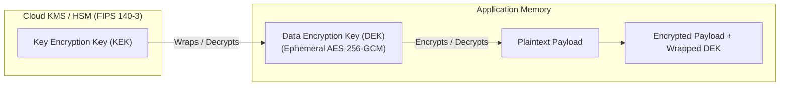

# 🔐 Cryptographic Key Management & PQC Reference

*References: [Managing cryptographic keys and secrets](https://www.cyber.gov.au/business-government/secure-design/secure-by-design/managing-cryptographic-keys-and-secrets) | [ACSC ISM Cryptography](https://www.cyber.gov.au/business-government/asds-cyber-security-frameworks/ism/cyber-security-guidelines/guidelines-for-cryptography) | [NIST PQC Standards (FIPS 203/204)](https://csrc.nist.gov/projects/post-quantum-cryptography)*

---

## 1. Key Management Plan (KMP) Lifecycle (FIPS 140-3)
- **Separation of Keys from Code**: Hardcoded API keys, private keys, or certificates in source files or configuration manifests are strictly prohibited.
- **Hardware Root of Trust**: Master keys and root certificates must be generated and stored in Hardware Security Modules (HSMs) or Cloud KMS complying with **FIPS 140-3**.
- **Cryptoperiods**:
  - **Originator Usage Period (OUP)**: Period during which key creates signatures/encryption ($\le 365\text{ days}$).
  - **Recipient Usage Period (RUP)**: Period during which data may be decrypted/verified.
  - **Automated Rotation**: Schedule automated rotation (90–365 days); test emergency rollover procedures annually.

---

## 2. Envelope Encryption Pattern

1. Client requests KMS to generate a data key: returns plaintext DEK and ciphertext wrapped DEK.
2. Client encrypts payload locally using plaintext DEK with **AES-256-GCM** or **ChaCha20-Poly1305**.
3. Plaintext DEK is immediately zeroized from memory. Ciphertext and wrapped DEK are stored together.

---

## 3. Ephemeral Workload Identity (OIDC Federation)
- Replace static, long-lived API tokens and service account keys with short-lived **OpenID Connect (OIDC)** identity tokens:
  - AWS IAM Roles for Service Accounts (IRSA) / EKS Pod Identity
  - Google Cloud Workload Identity Federation
  - Azure Managed Identities & Workload ID

---

## 4. Certificate Chain of Trust & Revocation
Every certificate presented must pass all four checks — skipping any one breaks the chain:
1. **Signature validation**: verify each certificate against the issuing CA's public key; reject on tampering.
2. **Chain verification**: the issuer sequence must terminate at a CA in the trust store. Keep the root CA offline; issue from intermediates so a compromised intermediate can be revoked without replacing the root.
3. **Expiry**: reject expired certificates anywhere in the chain — never "warn and continue".
4. **Revocation**: check CRL or OCSP on use. A certificate can be revoked long before it expires.

- **Trust only verified public certificates.** A malicious intermediate lets an attacker mint end-entity certs at will.
- Revoking a CA must revoke everything it signed.
- Monitor expiry dates and renew ahead of time; an unplanned expiry forces an emergency rollover.

---

## 5. Positions of Trust & Separation of Duties
Roles with access to keys and secrets (crypto custodians, admins, privileged CI) carry extra obligations and are a prime target for both external attack and insider misuse:
- **Least privilege + separation of duties**: split critical key operations so no single person can generate, export, and destroy. Revalidate privileged access on a schedule; unchecked standing access is how a single compromise becomes an organisational one.
- **No lone zones**: require secondary verification for changes to high-value keys.
- **Never store keys or secrets in clear text**, including in backups and config files.
- **Audit and monitor** key usage, certificate status, and expiry — but never log the key or secret material itself, or the monitoring system becomes the new target.
- **Escrow and recovery** are additional attack surfaces. Support them only where required, and secure them to the same standard as the primary store.

---

## 6. Compromise Triggers → Rollover
Rollover is not only a scheduled activity. Trigger an immediate, unscheduled rollover on any of:
suspected compromise · certificate expiry missed · insufficient key length · a newly discovered weakness in the algorithm or its use · exposure through memory dump, logging, or a handling error · departure of a person in a position of trust.

Practise rollover before you need it — the first unplanned rollover should not be the first time the procedure runs. More frequent rotation is not automatically safer; rollover itself carries operational risk.

> **The worst compromise is one that is not detected.** Sufficient logging and monitoring is what turns a silent breach into an incident you can actually respond to.

---

## 7. Post-Quantum Cryptography (PQC) Transition Checklist
Design crypto agility into protocols to prepare for quantum decryption threats:
- **Key Encapsulation (KEM)**: Transition from RSA/ECDH to **ML-KEM (FIPS 203)** (formerly Kyber).
- **Digital Signatures**: Transition from RSA/ECDSA/Ed25519 to **ML-DSA (FIPS 204)** (formerly Dilithium) and **SLH-DSA (FIPS 205)** (formerly SPHINCS+).
- **Hybrid Exchange**: Deploy hybrid TLS key exchange (X25519 + ML-KEM-768) during transition periods.
