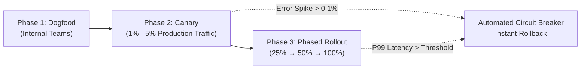

# 🚀 Safe Software Deployment Reference

*References: [Safe software deployment: Reliability for customers](https://www.cyber.gov.au/business-government/secure-design/secure-by-design/safe-software-deployment-how-software-manufacturers-can-ensure-reliability-for-customers) | [CISA/FBI/ACSC Safe Deployment](https://www.cisa.gov/resources-tools/resources/secure-by-design)*

---

## 1. Pre-Mortem & Operational Risk Assessment
Before writing code or changing infrastructure configurations, execute a pre-mortem:
- **Dependency Failure Modes**: What happens if an external auth provider, KMS endpoint, or message queue becomes unavailable?
- **IAM Permission Changes**: Does this release alter permissions on shared Service Accounts or Cloud IAM roles?
- **Database Schema Migrations**: Are migrations backward-compatible (expand-and-contract pattern) so older instances don't crash during rolling deploys?

---

## 2. Canary & Phased Rollout Pipeline

1. **Automated Health Signals**: Monitor error rate ($> 0.1\%$), P99 latency spikes, and crash logs continuously during canary phases.
2. **Emergency Stop & Circuit Breaker**: Immediate automated rollback trigger that reverts traffic to the previous known-good release artifact without human intervention.
3. **Immutable Build Artifacts**: Build once, sign cryptographically, and deploy the exact same immutable container/binary across staging and production.
